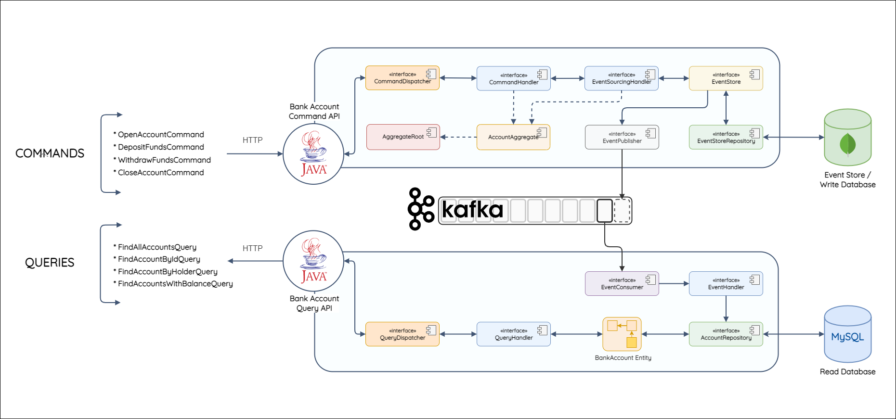

# Tech Bank API with Kafka

The Tech Bank API implements with Event-Sourcing and the CQRS pattern, supported by [Apache Kafka](https://kafka.apache.org/) for event-streaming. This project's used for demonstration only.



## Usage

Before using this project, you must have these requirements:

- Install [IntelliJ](https://www.jetbrains.com/idea/)
- Install [Docker](https://www.docker.com/)
- Install [Java JDK](https://www.oracle.com/java/technologies/downloads/) (This project currently uses Java18)

Clone this project:

```bash
$ git clone https://github.com/shelldog/event-driven-tech-bank.git
```

Open the project with IntelliJ and run as usual
